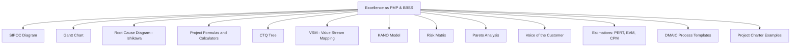

# 🎯 PMP & Six Sigma Black Belt Excellence Toolkit

Welcome! This repository contains notes, diagrams, tools, templates, and formulas to help you become an outstanding **Project Management Professional (PMP)** and **Six Sigma Black Belt (BBSS)**.

---

## 📚 What’s Inside

- ✅ Project Management Tools & Formulas
- ✅ Lean Six Sigma DMAIC methods
- ✅ Quality Management techniques
- ✅ Root Cause Analysis visuals
- ✅ Risk assessment matrices
- ✅ Diagrams, templates, and calculators
- ✅ Real-world examples for practical use

---

## 📈 Methods & Tools Overview



---

```
  [🎓 Excellence as PMP & BBSS]
  [📋 SIPOC Diagram]
  [📊 Gantt Chart]
  [🔍 Root Cause Diagram Ishikawa]
  [📐 Project Formulas & Calculators]
  [🌲 CTQ Tree]
  [📦 VSM (Value Stream Mapping)]
  [🎯 KANO Model]
  [⚠️ Risk Matrix]
  [📉 Pareto Analysis]
  [💬 Voice of the Customer]
  [🧮 Estimations: PERT, EVM, CPM]
  [🔄 DMAIC Process Templates]
  [📌 Project Charter Examples]
```
---
## 🧠 Goal
To centralize the most practical, visual, and critical-thinking tools that can:

Accelerate decision making

Increase quality and efficiency

Align with PMI & Six Sigma standards

Support certification prep and real project execution

---

## 📁 Repository Structure


/diagrams
/tools
/formulas
/templates
/examples

---
## 🚀 Ready to Improve?
Whether you're studying for your PMP certification, leading a DMAIC project, or streamlining operations, this repo is your command center.

⭐ Contributions welcome! Let’s build the ultimate reference for project and quality management.

---
